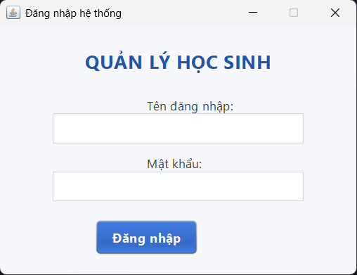
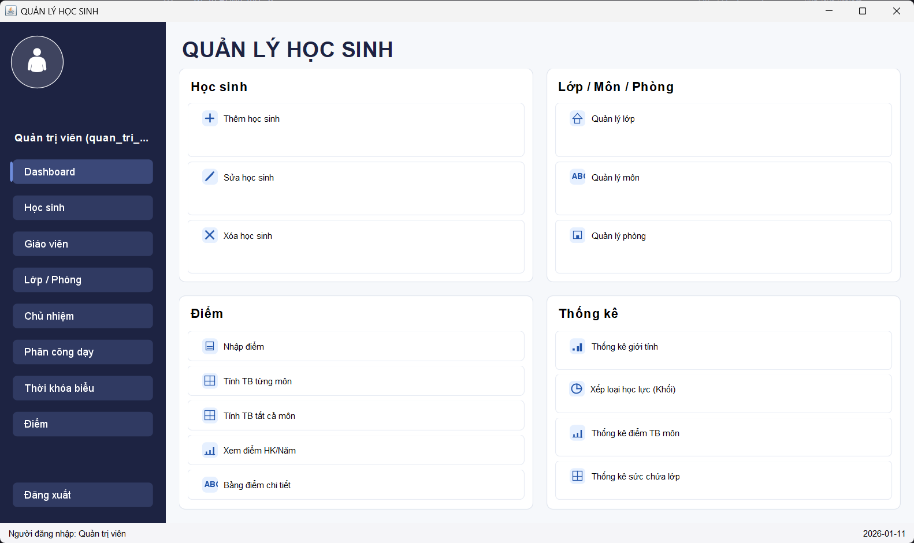
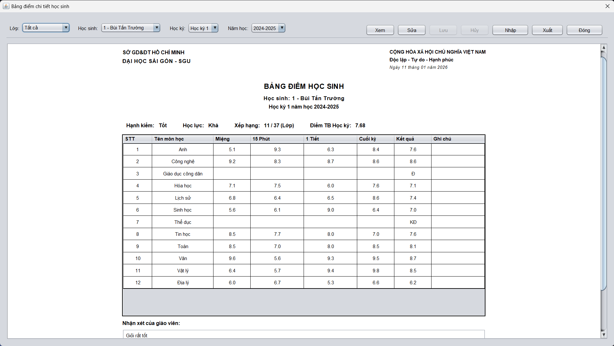

# 🎓 QLHS - Quản Lý Học Sinh

Ứng dụng quản lý học sinh trường THPT được phát triển bằng Java Swing với kiến trúc 3 tầng (DTO - BUS - Database).


---

## Screenshots

### Màn hình đăng nhập


### Dashboard - Quản lý học sinh


### Bảng điểm học sinh


---

## 📋 Tính năng chính

### 🔐 Hệ thống phân quyền
- **Quản trị viên**: Toàn quyền quản lý hệ thống
- **Giáo viên chủ nhiệm**: Quản lý lớp chủ nhiệm, nhập điểm, theo dõi học sinh
- **Giáo viên bộ môn**: Nhập điểm môn học được phân công
- **Học sinh**: Xem thông tin cá nhân, điểm số, thời khóa biểu

### 📊 Quản lý dữ liệu
| Module | Mô tả |
|--------|-------|
| **Dashboard** | Tổng quan thống kê, biểu đồ |
| **Học sinh** | CRUD thông tin học sinh, phụ huynh |
| **Giáo viên** | Quản lý thông tin giáo viên |
| **Lớp / Phòng** | Quản lý lớp học và phòng học |
| **Chủ nhiệm** | Phân công giáo viên chủ nhiệm |
| **Phân công dạy** | Phân công giáo viên dạy môn học |
| **Thời khóa biểu** | Quản lý và hiển thị TKB |
| **Điểm** | Nhập và quản lý điểm học sinh |
| **Thống kê** | Báo cáo, thống kê học tập |

### 🛠️ Tính năng bổ sung
- Xuất/Nhập dữ liệu Excel (Apache POI)
- Xuất báo cáo PDF (PDFBox)
- Giao diện hiện đại với Nimbus Look&Feel

---

## 🏗️ Kiến trúc hệ thống

```
src/com/sgu/qlhs/
├── dto/          # Data Transfer Objects (12 entities)
├── bus/          # Business Logic Layer (13 services)  
├── database/     # Data Access Layer (DAO + Connection)
├── tools/        # Utilities (Export/Import helpers)
└── ui/           # User Interface
    ├── components/   # Reusable UI components
    ├── panels/       # Main feature panels
    └── dialogs/      # Dialog windows
```

---

## ⚙️ Yêu cầu hệ thống

- **JDK**: 23 hoặc cao hơn
- **MySQL**: 8.0 hoặc cao hơn
- **RAM**: Tối thiểu 2GB
- **OS**: Windows / macOS / Linux

---

## 🚀 Cài đặt và chạy

### 1️⃣ Clone repository

```bash
git clone <repository-url>
cd QLHS
```

### 2️⃣ Khởi tạo Database

```powershell
# Mở MySQL và import database
mysql -u root -p < db\init.sql
```

> **Note**: Script sẽ tạo database `QLHS_New` với dữ liệu mẫu.

### 3️⃣ Cấu hình kết nối (tùy chọn)

Có thể đặt thông tin kết nối qua **biến môi trường**:
```powershell
$env:QLHS_DB = "QLHS_New"
$env:QLHS_USER = "root"
$env:QLHS_PASS = "your_password"
```

Hoặc **system properties** khi chạy:
```powershell
java -Ddb.name=QLHS_New -Ddb.user=root -Ddb.pass=password ...
```

### 4️⃣ Compile source code

```powershell
javac -encoding UTF-8 -d build/classes -cp "lib/*" -sourcepath src (Get-ChildItem -Recurse -Filter "*.java" -Path src | ForEach-Object { $_.FullName })
```

### 5️⃣ Chạy ứng dụng

```powershell
java -cp "build/classes;lib/*" com.sgu.qlhs.ui.DangNhapUI
```

---

## 📦 Thư viện sử dụng

| Thư viện | Phiên bản | Mục đích |
|----------|-----------|----------|
| MySQL Connector/J | 9.4.0 | Kết nối MySQL |
| Apache POI | 5.2.3 | Xuất/Nhập Excel |
| PDFBox | 2.0.35 | Xuất PDF |
| Log4j | 2.18.0 | Logging |
| Commons IO | 2.11.0 | File utilities |

---

## 📁 Cấu trúc thư mục

```
QLHS/
├── src/                    # Source code Java
├── lib/                    # Thư viện bên thứ 3
├── db/
│   ├── init.sql           # Script khởi tạo database
│   └── README.md          # Hướng dẫn database
├── build/
│   └── classes/           # Compiled .class files
├── nbproject/             # NetBeans project files
├── build.xml              # Ant build script
└── README.md              # File này
```

---

## 👥 Tài khoản demo

> Sau khi import `db/init.sql`, sử dụng các tài khoản có sẵn trong database để đăng nhập.

---

## 📝 License

MIT License - Xem file [LICENSE](LICENSE) để biết thêm chi tiết.

---

**© 2026 - Đại học Sài Gòn (SGU)**
